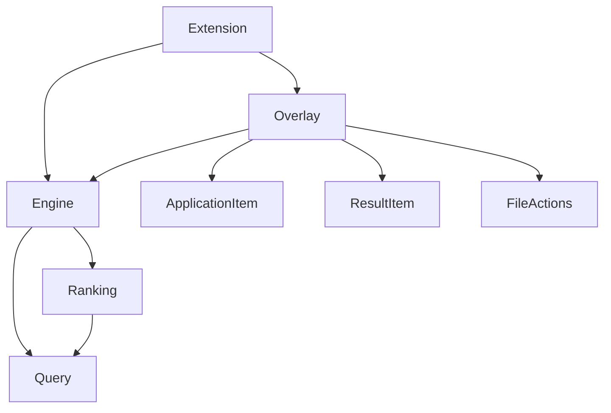
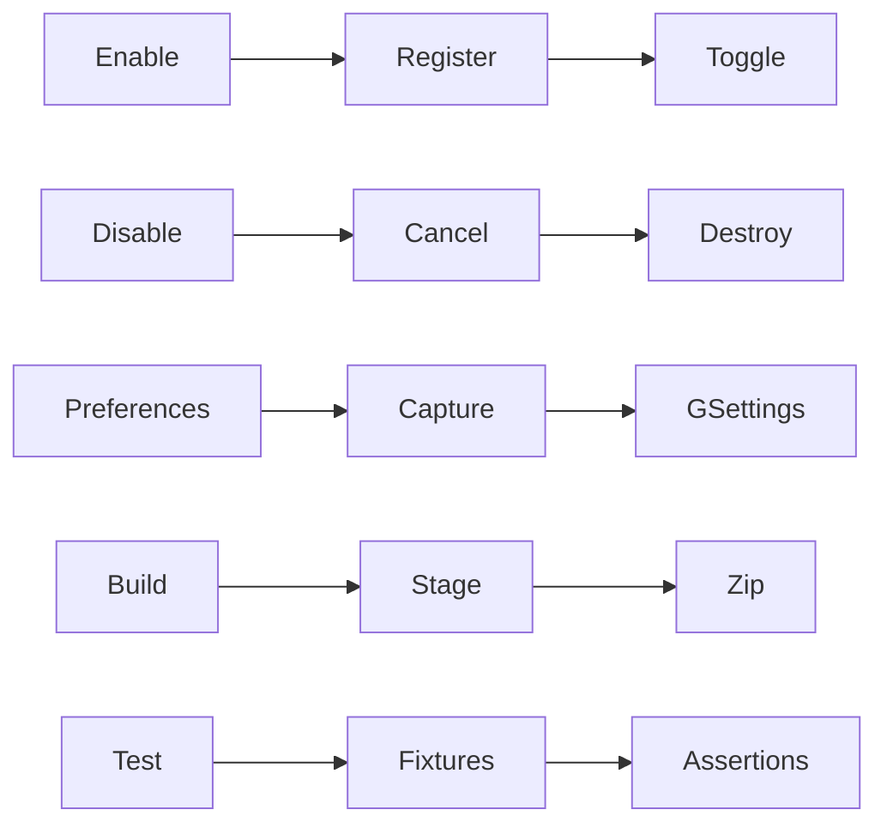
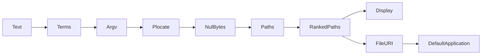

# Repository Specification — Search Everything Lightly

Target repository: search_everything_lightly · commit unavailable (workspace has no readable Git history).  
Status: implemented version 0.2.0; physical desktop acceptance pending.

Generated by: repo-skillopt 0.10.0 · Codex adapter · 2026-09-10.
Grounding: source, installed GNOME 49 resources, executable tests. The skill package has no template files; the required 19-section format is reproduced below.

The user’s follow-up replaces the original minimum of three characters and literal-only matching with one-character search and filename masks, and adds application tiles and the compact transparent UI.

## 1. Repository overview

**[fact]** `metadata.json:1` — GNOME Shell extension for local application and filename search. Initially only the supplied technical specification existed; implementation is new, not a legacy migration.

## 2. Technology stack

| Component | Value | Evidence | Label |
|---|---|---|---|
| Runtime | GJS / GNOME Shell 49 | `metadata.json:5`, `extension.js:2` | **[fact]** |
| UI | St / Clutter modal, GTK4 / libadwaita preferences | `src/searchOverlay.js:2`, `prefs.js:2` | **[fact]** |
| Search | external plocate, asynchronous Gio.Subprocess | `src/searchEngine.js:42` | **[fact]** |
| Build / tests | Python stdlib, GLib, gettext, Node built-in test | `Makefile:1`, `package.json:1` | **[fact]** |

## 3. Build and runtime commands

**[fact]** `Makefile:1` — `make build`, `pack`, `lint`, `test`, `install`, `uninstall`, `enable`, `disable`, `prefs`. `tests/run_shell_smoke.py:main` starts an independent headless Shell, not the user's existing compositor.

## 4. Major entrypoints

**[fact]** `extension.js:enable` and `extension.js:disable` are Shell lifecycle hooks. `prefs.js:fillPreferencesWindow` is the separate settings process. `src/searchOverlay.js:toggle` is the global shortcut action.

## 5. Architectural layers

**[fact]** `extension.js:12`, `src/searchOverlay.js:18`, `src/searchEngine.js:15`, `src/fileActions.js:46` — lifecycle owns UI and engine; UI schedules search and file actions; engine owns subprocesses and ranking; file actions own Gio/DBus operations. Pure query/ranking modules do not import GNOME UI libraries.

## 6. Core modules

**[fact]** `src/query.js:39` — ordinary terms become escaped substring arguments after `--`; unescaped `*` and `?` use full-basename masks with `--basename`. `src/ranking.js:33` sorts distinct paths with name quality ahead of location priority. `src/resultItem.js:12` creates a row and queries its icon asynchronously. `src/searchEngine.js:24` terminates and cancels the active request. `src/searchOverlay.js:114` invalidates UI generations, debounce and pending actions. `src/fileActions.js:46` handles open, parent and reveal actions.

**[fact]** `src/applicationItem.js:11` searches GNOME’s application cache and filters hidden/restricted entries. Its square tiles precede file rows. `src/searchOverlay.js:208` uses GNOME’s native visibility helper for scrolling; `src/searchOverlay.js:255` activates the selected Shell.App.

### Symbols not yet analyzed

57 defined, 30 analyzed, 27 listed (named functions/classes). Anonymous callbacks belong to their enclosing methods.

**prefs.js**

- `SearchPreferences` — `prefs.js:9`

**src/fileActions.js**

- `checkFile()` — `src/fileActions.js:5`
- `launch()` — `src/fileActions.js:18`
- `reveal()` — `src/fileActions.js:31`

**src/query.js**

- `queryTerms()` — `src/query.js:8`
- `abbreviatePath()` — `src/query.js:53`
- `displayText()` — `src/query.js:59`

**src/ranking.js**

- `normalize()` — `src/ranking.js:4`
- `matchRank()` — `src/ranking.js:8`
- `locationRank()` — `src/ranking.js:23`

**src/searchEngine.js**

- `.constructor()` — `src/searchEngine.js:16`
- `._clearTimer()` — `src/searchEngine.js:35`

**src/searchOverlay.js**

- `.constructor()` — `src/searchOverlay.js:19`
- `.close()` — `src/searchOverlay.js:93`
- `.destroy()` — `src/searchOverlay.js:100`
- `._setStatus()` — `src/searchOverlay.js:141`
- `._activate()` — `src/searchOverlay.js:264`

**tests/integration.js**

- `assert()` — `tests/integration.js:10`
- `test()` — `tests/integration.js:15`
- `expectCode()` — `tests/integration.js:21`

**tests/run_shell_smoke.py**

- `session` — `tests/run_shell_smoke.py:16`

**tests/shellSmoke.js**

- `delay()` — `tests/shellSmoke.js:8`
- `until()` — `tests/shellSmoke.js:15`
- `assert()` — `tests/shellSmoke.js:24`
- `key()` — `tests/shellSmoke.js:29`
- `hotkey()` — `tests/shellSmoke.js:34`
- `screenshot()` — `tests/shellSmoke.js:42`

## 7. Domain model

| Kind | Inventory | Examples / Evidence | Label |
|---|---|---|---|
| module | 9 production JS files | `extension.js:1`, `prefs.js:1`, `src/query.js:1` | **[fact]** |
| class | 7 production classes | `extension.js:11`, `src/searchEngine.js:8`, `src/resultItem.js:12` | **[fact]** |
| function | Complete counts in symbols.json | `.reposkillopt/specs/symbols.json` | **[fact]** |
| data entity | query, request, path, application, shortcut | `src/query.js:12`, `src/searchEngine.js:63`, `schemas/org.gnome.shell.extensions.search-everything-lightly.gschema.xml:5` | **[fact]** |
| route / job / abstraction | 0 HTTP routes, 0 index jobs, 0 shared internal base classes with ≥2 subclasses | `extension.js:1`, `src/searchEngine.js:1` | **[fact]** |

**[fact]** `extension.js:9`, `src/searchOverlay.js:12`, `src/searchEngine.js:5`, `src/ranking.js:2` — edges denote imports and object ownership; Shell/framework inheritance targets are external, not inferred internal abstractions.

## 8. Data model

No extension-owned application database or custom file index; application search uses GNOME’s cache. An ER diagram is not applicable.

| Field | Persistence | Evidence | Label |
|---|---|---|---|
| `toggle-search: as` | GSettings; default `<Super>space` | `schemas/org.gnome.shell.extensions.search-everything-lightly.gschema.xml:5` | **[fact]** |
| query / result paths / applications | transient UI state | `src/searchOverlay.js:130` | **[fact]** |
| process / cancellable / timer | transient request ownership | `src/searchEngine.js:63` | **[fact]** |

## 9. External integrations

**[fact]** `src/searchEngine.js:55` — plocate is spawned with an argv array. `src/fileActions.js:20` — default application launch is asynchronous. `src/fileActions.js:33` — FileManager1.ShowItems uses a 1500 ms DBus timeout and falls back to the parent. `po/ru.po:1` provides Russian gettext messages.

## 10. Control-flow traces

1. **[fact]** `extension.js:16` registers a shortcut targeting `SearchOverlay.toggle`.
2. **[fact]** `src/searchOverlay.js:146` clears old work and schedules `_search` after debounce.
3. **[fact]** `src/searchEngine.js:42` collects subprocess output asynchronously and ranks candidates.
4. **[fact]** `src/searchOverlay.js:167` checks the generation before creating rows.
5. **[fact]** `src/searchOverlay.js:218`, `src/fileActions.js:46` dispatch the selected action to Gio.

### Business workflows

**[fact]** `Makefile:1` — CLI entrypoints: 10 named targets including `all`; HTTP: 0; scheduled jobs: 0. Lifecycle hooks: 2; preferences entrypoint: 1; global shortcut: 1. Auxiliary executable scripts: `scripts/build.py`, `scripts/check.py`, `tests/run_integration.py`, `tests/run_shell_smoke.py`; test modules run through their documented runners. All are local.

1. **[fact]** `extension.js:12` creates the engine and overlay, then registers the shortcut; `extension.js:22` reverses ownership.
2. **[fact]** `prefs.js:10`, `prefs.js:47` render preferences, capture a shortcut, and write GSettings. Reset invokes the schema default.
3. **[fact]** `scripts/build.py:1` stages whitelisted files, compiles schemas/translations and writes ZIP; `Makefile:13` installs that stage; enable/disable/prefs/uninstall invoke `gnome-extensions`.
4. **[fact]** `scripts/check.py:1`, `tests/run_integration.py:1`, `tests/run_shell_smoke.py:main` validate sources and execute fixtures. `tests/check_archive.py:1` checks ZIP contents and installs it with GNOME's CLI into temporary XDG directories. No scheduled indexing is registered by the extension.

## 11. Data-flow traces

1. **[fact]** `src/query.js:39` escapes metacharacters without involving a shell.
2. **[fact]** `src/searchEngine.js:75` communicates using bytes, then splits NUL-delimited UTF-8 paths.
3. **[fact]** `src/ranking.js:33` deduplicates and limits results; `src/resultItem.js:22` sanitizes control characters only for display.
4. **[fact]** `src/fileActions.js:46` opens the original path, preserving its actual filename.

## 12. Dependency map

| Owner | Dependency | Evidence | Label |
|---|---|---|---|
| Shell entrypoint | Main, Meta, Shell, overlay, engine | `extension.js:2` | **[fact]** |
| overlay | ModalDialog, application tiles, ResultItem, file actions, query limits, native scroll helper | `src/searchOverlay.js:2` | **[fact]** |
| engine | Gio, GLib, query, ranking | `src/searchEngine.js:2` | **[fact]** |
| preferences | GTK, Gdk, Adw; no Shell UI imports | `prefs.js:2` | **[fact]** |

## 13. Configuration map

| Setting | Value / scope | Evidence | Label |
|---|---|---|---|
| minimum / maximum query | 1 / 256 characters | `src/query.js:2` | **[fact]** |
| candidates / results | 300 / 50 | `src/query.js:4` | **[fact]** |
| debounce / process timeout | 100 / 3000 ms | `src/query.js:6`, `src/searchEngine.js:16` | **[fact]** |
| default shortcut | Super+Space | `schemas/org.gnome.shell.extensions.search-everything-lightly.gschema.xml:6` | **[fact]** |
| plocate pruning | external `/etc/updatedb.conf` | `README.md` | **[fact]** |

## 14. Testing strategy

**[fact]** `tests/query.test.js:1`, `tests/ranking.test.js:1` — 11 pure logic checks. `tests/integration.js:1` — 15 GJS/plocate cases. `tests/shellSmoke.js:run` — real headless Shell, virtual-keyboard hotkey, Gio launch recorder, FileManager1 success/fallback, focus/scrolling and lifecycle; application order/launch, masks, single-character queries, compact dimensions and no lightbox. The test driver is injected only into a disposable copy (`tests/run_shell_smoke.py:main`).

## 15. Deployment assumptions

**[fact]** `metadata.json:1`, `Makefile:13` — UUID `search_everything_lightly@dmitrykalinin5.github.com`; user extension installation; GNOME 49 only. **[unknown]** Compatibility with other Shell versions and distributions is not established. GNOME session restart is required after changing loaded JS on Wayland (`README.md`).

## 16. Change-impact map

**[fact]** `src/query.js:1`, `src/ranking.js:1` — search syntax/ranking changes require pure tests and real plocate fixtures. `src/searchOverlay.js:1` and `src/resultItem.js:1` changes require Shell screenshots and lifecycle checks. `prefs.js:1` and the schema affect a separate GTK process. `scripts/build.py:1` defines the archive contents.

## 17. Known risks

**[fact]** `src/query.js:4` — only the first 300 plocate candidates are reranked, so a better match outside that set cannot be shown. `README.md` documents stale/pruned indexes and the default keyboard-layout conflict. **[inference]** Private ModalDialog monitor positioning may require changes for future Shell versions; basis: `src/searchOverlay.js:90` uses `_monitorConstraint` after the installed GNOME 49 implementation was inspected.

## 18. Unknowns and unresolved questions

**[unknown]** Physical multi-monitor positioning, fractional/HiDPI scaling, screen locking, user-specific themes, and clean installation into a live account still require the checks in `tests/MANUAL.md`. Other distributions and GNOME versions are not validated. The user selected the publication UUID; the public repository URL is not supplied. No EGO publication was attempted.

## 19. Evidence index

| Evidence | Role | Label |
|---|---|---|
| `metadata.json`, `Makefile`, `package.json` | Target runtime and commands | **[fact]** |
| `extension.js`, `prefs.js` | Lifecycle and preferences | **[fact]** |
| `src/searchOverlay.js`, `src/resultItem.js` | UI and resource ownership | **[fact]** |
| `src/searchEngine.js`, `src/query.js`, `src/ranking.js`, `src/fileActions.js` | Search and opening | **[fact]** |
| `schemas/org.gnome.shell.extensions.search-everything-lightly.gschema.xml`, `po/ru.po` | Persistent shortcut and translations | **[fact]** |
| `scripts/build.py`, `scripts/check.py` | Distribution and validation | **[fact]** |
| `tests/query.test.js`, `tests/ranking.test.js`, `tests/integration.js`, `tests/run_integration.py` | Logic and engine evidence | **[fact]** |
| `tests/shellSmoke.js`, `tests/run_shell_smoke.py`, `screenshots/overlay.png`, `screenshots/preferences.png` | Shell evidence | **[fact]** |
| `README.md`, `tests/MANUAL.md` | Usage and remaining acceptance work | **[fact]** |
| `.reposkillopt/specs/symbols.json`, `graphify-out/graph.json` | Mechanical declaration inventory | **[fact]** |
