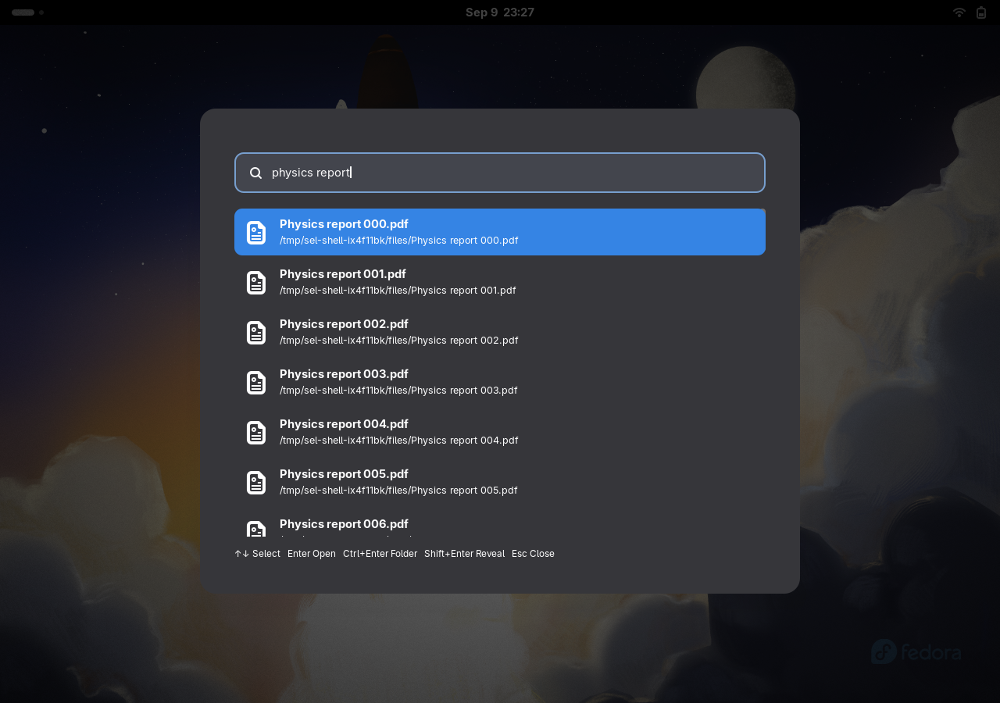

# Search Everything Lightly

Быстрый локальный поиск файлов и папок в отдельном окне GNOME Shell. Версия **0.1.0**, Fedora / GNOME Shell **49**, Wayland. Английский интерфейс и русский перевод через gettext.

Нажмите **Super+Space**, введите минимум три символа, выберите результат стрелками и нажмите Enter.



Реальный снимок из изолированного тестового сеанса GNOME 49.9 с демонстрационными файлами. [Окно настроек](screenshots/preferences.png). Скриншоты доступны в исходниках и не включаются в установочный архив.

## Возможности

- Поиск по существующему индексу `plocate`, без учёта регистра.
- Несколько слов означают «найти все слова»: `physics lab` находит `physics_lab.pdf`.
- Имя, сокращённый путь с `~`, системные MIME-иконки, прокрутка результатов.
- Ранжирование: точное имя → имя без расширения → начало имени → все слова в имени → совпадение в пути. Внутри каждой группы приоритет у HOME, затем других домашних каталогов, подключённых дисков и системных путей.
- Поиск через 100 мс после ввода, максимум 300 кандидатов и 50 результатов; тайм-аут 3 секунды. Сортировка работает внутри полученных кандидатов, а не по всему индексу.
- Старый процесс отменяется при изменении запроса, закрытии окна и отключении расширения.
- Окно на мониторе активного приложения, нативные цвета темы, поддержка масштабирования средствами St.
- Изменение горячей клавиши в настройках расширения.

Содержимое документов, фильтры и fuzzy matching пока не поддерживаются. Спецсимволы `*`, `?`, `[]`, кавычки и обратная косая черта ищутся буквально. Максимум — 256 символов. Ограничения Unicode case folding определяются `plocate`; ранжирование дополнительно нормализует Unicode.

## Установка на Fedora

Зависимости для сборки из исходников:

```bash
sudo dnf install plocate gettext make python3 glib2
make install
```

`make install` копирует расширение в `~/.local/share/gnome-shell/extensions/search-everything-lightly@ogultra/` (учитывает `XDG_DATA_HOME`). После первой установки **выйдите из сеанса GNOME и войдите снова**, затем:

```bash
make enable
make prefs
```

В Wayland нельзя перезапустить Shell через Alt+F2 → `r`. После изменения JS уже загруженного расширения также нужен новый сеанс.

Установка готового архива:

```bash
gnome-extensions install --force dist/search-everything-lightly@ogultra.shell-extension.zip
# После выхода и повторного входа:
gnome-extensions enable search-everything-lightly@ogultra
```

### Горячая клавиша и раскладка

По умолчанию используется **Super+Space** из ТЗ. GNOME часто использует это же сочетание для переключения раскладки. Откройте `make prefs` и назначьте, например, **Ctrl+Super+Space**. Расширение не меняет системные сочетания клавиш. Чтобы записать сочетание, нажмите кнопку с текущими клавишами, затем новое сочетание; Escape отменяет запись, кнопка сброса возвращает Super+Space.

## Подготовка индекса

Расширение не устанавливает пакеты, не запускает `sudo` и не выполняет `updatedb`. При отсутствии `plocate` или проблеме с индексом в окне отображается сообщение.

При необходимости создайте индекс **самостоятельно**:

```bash
sudo updatedb
```

Проверьте штатный таймер Fedora:

```bash
systemctl status plocate-updatedb.timer
# Если он отключён и вы хотите ежедневное обновление:
sudo systemctl enable --now plocate-updatedb.timer
```

Проверка поиска вне расширения:

```bash
plocate --ignore-case --existing --limit 10 -- Documents
```

Если команда сообщает `Permission denied`, проверьте установку пакета `plocate` и права на индекс. Не делайте системную базу общедоступной: штатный `plocate` проверяет видимость путей для текущего пользователя. В ограниченной среде разработки setgid-доступ к системному индексу может быть недоступен, даже если поиск в обычном терминале работает.

Новые файлы появятся только после обновления индекса. Удалённые отсекаются через `--existing`. Скрытые и системные файлы участвуют в поиске, если доступны пользователю и включены в индекс. Диски и каталоги, исключённые настройками `/etc/updatedb.conf`, не найдутся: на Fedora `/run`, `/media` и некоторые файловые системы обычно исключены. Расширение не обходит правила индексации.

## Управление

| Клавиша | Действие |
|---|---|
| Super+Space / выбранное сочетание | Открыть или закрыть поиск |
| Escape | Закрыть |
| ↑ / ↓ | Выбрать результат |
| Enter | Открыть файл или папку стандартным приложением |
| Ctrl+Enter | Открыть родительскую папку |
| Shift+Enter | Выделить в файловом менеджере через FileManager1; при недоступности открыть родительскую папку |
| Ctrl+L | Вернуть фокус в поле ввода |
| Ctrl+A | Выделить запрос |
| Щелчок по результату | Открыть |

После успешного открытия окно закрывается. При ошибке остаётся открытым с пояснением. Новый вызов очищает запрос.

## Настройки

```bash
make prefs
```

В 0.1 доступна смена сочетания клавиш и информация о зависимости/индексе. GSettings-схема: `org.gnome.shell.extensions.search-everything-lightly`, ключ `toggle-search`, тип `as`. Минимальная длина (3), задержка (100 мс), лимиты (300/50) пока заданы в `src/query.js`.

## Разработка и проверка

Для автоматических тестов дополнительно нужны `nodejs`, `gjs` и `plocate` с `updatedb`:

```bash
sudo dnf install nodejs gjs
make lint
make test
make pack
```

`make lint` проверяет синтаксис JS, локальные импорты, метаданные, GSettings-схему и каталог переводов. Это проверка без npm-зависимостей, а не полноценный ESLint.

`make test` проверяет запросы и ранжирование в Node.js, затем запускает GJS и настоящий `plocate` на отдельной временной базе. Проверяются Unicode, спецсимволы, переводы строк в именах, удалённые файлы, лимиты, ошибки индекса, тайм-аут, отмена и быстрые последовательные запросы. Системный индекс не изменяется.

Дополнительная проверка в отдельном headless GNOME Shell:

```bash
make build
python3 tests/run_shell_smoke.py
python3 tests/check_archive.py
```

Она использует отдельный D-Bus, виртуальный монитор 1280×900, временные настройки и базу. Настоящая виртуальная клавиатура проверяет глобальную горячую клавишу; Enter, Ctrl+Enter и Shift+Enter проверяются с временным обработчиком файлов и тестовым FileManager1. Проверяются фокус, прокрутка, размеры строк, повторное включение и открытие GTK-настроек. Скриншоты и журнал сохраняются в указанном скриптом каталоге `/tmp/sel-shell-*`; текущий рабочий сеанс не изменяется. Эта проверка требует окружения, разрешающего D-Bus и запуск headless Mutter.

На Fedora 43 / GNOME Shell 49.9 прошли 10 проверок логики, 13 интеграционных проверок GJS и проверки headless Shell. Реальные несколько мониторов, дробное масштабирование, блокировка экрана и другие дистрибутивы остаются в ручном списке перед публикацией.

Архив: `dist/search-everything-lightly@ogultra.shell-extension.zip`. Он содержит только необходимые исходники, метаданные, стили, схему, русский каталог gettext, README и лицензию. Тесты и служебные файлы разработки в архив не попадают.

Команды управления:

```bash
make disable
make uninstall
```

Логи GNOME Shell:

```bash
journalctl --user -f -o cat /usr/bin/gnome-shell
```

Расширение не пишет запросы и найденные пути в журнал. Инструкция ручной проверки — [tests/MANUAL.md](tests/MANUAL.md).

## Структура

| Файл | Назначение |
|---|---|
| `extension.js` | Включение, отключение, глобальная клавиша |
| `src/searchOverlay.js` | Модальное окно, debounce, фокус, клавиатура, защита от старых ответов |
| `src/searchEngine.js` | Асинхронный subprocess, отмена, тайм-аут, ошибки индекса |
| `src/query.js`, `src/ranking.js` | Подготовка буквальных запросов и ранжирование |
| `src/resultItem.js` | Строка результата и асинхронная MIME-иконка |
| `src/fileActions.js` | Gio-открытие и FileManager1 |
| `prefs.js` | Отдельный GTK4/libadwaita-процесс настроек |

API сверены с установленным GNOME Shell 49.9 и [документацией GJS](https://gjs.guide/extensions/upgrading/gnome-shell-49.html). Очистка ресурсов следует [правилам ревью GNOME Extensions](https://gjs.guide/extensions/review-guidelines/review-guidelines.html). Другие версии GNOME пока не заявлены.

## Дальнейшие версии

- 0.2: лимит результатов, скрытые файлы, исключённые каталоги.
- 0.3: фильтры и fuzzy ranking.
- 0.4: Search Provider и отключаемая локальная история.
- Перед 1.0: проверки на реальных мониторах/масштабах, скриншоты, чистая установка и ревью для extensions.gnome.org.

UUID для разработки выбран как `search-everything-lightly@ogultra`. Перед первой публикацией подтвердите его и добавьте URL публичного репозитория в metadata.json. После публикации UUID лучше сохранять. Автоматическая публикация не выполняется.

## Приватность

Всё работает локально. Нет сетевых запросов, внешних API, телеметрии и истории запросов. Расширение использует существующую базу `plocate` и запускает стандартное приложение только по выбору пользователя.

## Лицензия

GPL-3.0-or-later. Полный текст — [LICENSE](LICENSE).
